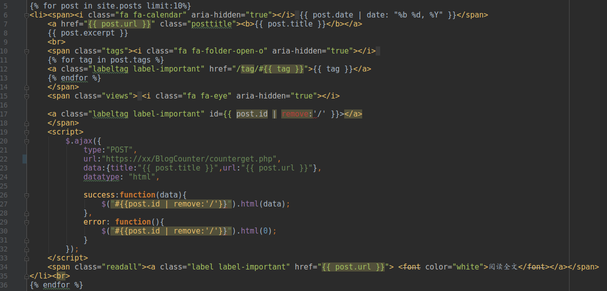
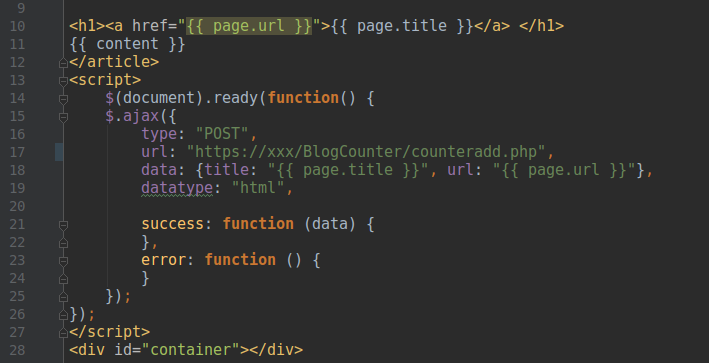
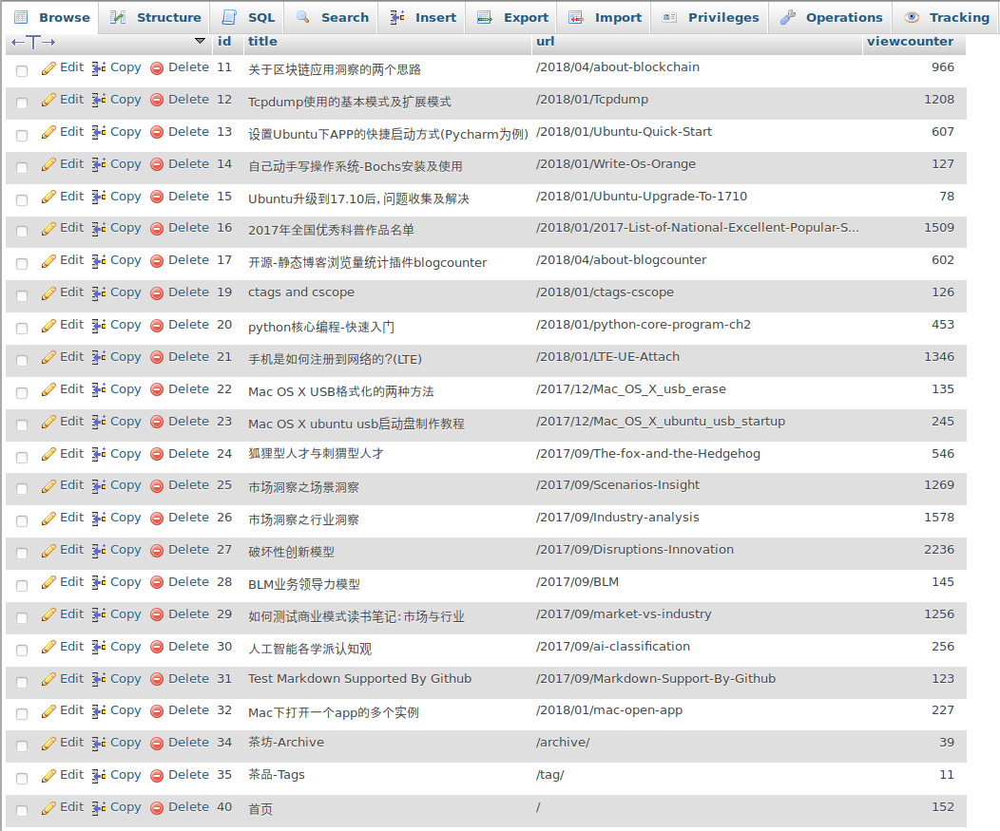

## 浏览量统计参考我的github博客

URL:[http://tanwubin.github.io](http://tanwubin.github.io)

## blogcounter介绍

博客爱好者肯定都折腾过不少平台，不同搭建方式，比如wordpress，但由于主机托管、域名备案
等原因，若干年后，疲于对服务器的维护而转到github+jekyll静态博客托管，这种方式有很多好处，一是
不用维护托管主机，二是基于github方式，数据也可以备份，三是还能遇到一群开源爱好者。

blogcounter正是在这个背景下产生的，解决静态博客文章访问量的统计问题。

blogcounter原理如下：

Ajax+PHP，用户访问post页面时，通过ajax向服务端发起POST请求，服务端接受到请求后，
刷新后台数据库中的访问数据。

目录结构说明如下：
counteradd.php，服务端程序，用于向数据库中刷新浏览量

counterget.php，服务端程序，用于从数据库中获取浏览量

index.html，模拟博客首页，展示获取博客浏览量

page.html，模拟查看博文，增加浏览量

pagecounteradd.js，客户端增加浏览量js文件

pagecounterget.js，客户端获取浏览量js文件

## 数据库

见源码中blogcounter.sql，下载后导入数据库即可

## 如何运用到自己的博客？

1、服务端部署

1.1 导入数据库

1.2 counteradd.php和counterget.php两个文件部署到服务端，并根据实际情况修改数据库连接的用户名和密码

$userName = "root";

$passWord = "root";

服务端部署OK后，可以通过浏览器打开URL确认是否部署成功

2、静态网页部署（以jekyll为例，其他也是类似的）

2.1 default.html导入jquery库

2.1 首页部署

将pagecounterget.js拷贝到index.html，如下图，url根据自身情况适配

2.2 博文页部署

将pagecounteradd.js拷贝到post.html,如下图，url根据自身情况适配

2.3 其他单页部署

方法与首页和博文页面完全相同

## 统计效果

